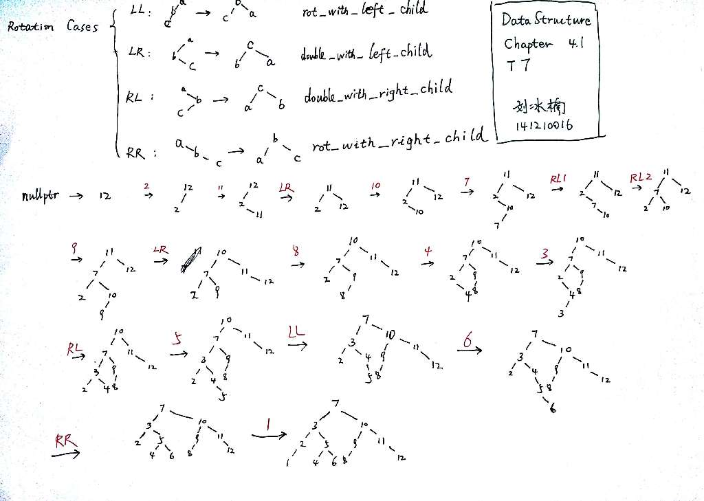
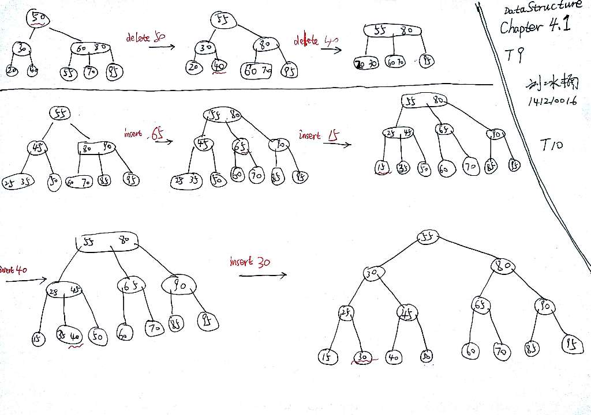

# ch4.1_all 

### README


### 1. (a) Show the result of inserting 3, 1, 4, 6, 9, 2, 5, 7 into an initially empty binary search tree. (b) Show the result of deleting the root.
#### Solution - a
See `ch4.1_1_a.gv.png` 


#### solution - b

See `ch4.1_1_b.gv.png`


### 2. 写一递归函数实现在带索引的二叉搜索树( IndexBST) 中查找第 k 个小的元素。

#### solution
If implement as a function outside the class:
```c++
template <typename T>
T k_th_small(const BST<T> &t, int k) {
    if (t.isEmpty()) {
        return 0;
    }
    int p = t.get_leftsize();
    if (p == k) {
        return t.get_rootElment();
    }
    else if (p > k) {
        k_th_small(t.left, k);
    }
    else (p < k) {
        k_th_small(t.right, k - p); 
    }
}
```

If implement as a class method:
```c++
template <typename T>
class BST {
  public:
    T k_th_small(int k) const {
        return k_th_small(root, k);
    }
    
  private:
    T k_th_small(BSTNode *node, int k) {
        if (!node) {
            return 0;
        }
        int p = node->leftsize;
        if (p == k) {
            return node->element;
        }
        else if (p > k) {
            k_th_small(node->left, k);
        }
        else (p < k) {
            k_th_small(node.right, k - p); 
        }
    }
};
```

### 3. 对一棵空的 AVL 树,分别画出插入关键码为 { 16 , 3 , 7 , 11 , 9 , 28 , 18 , 14 , 15} 后的 AVL 树。
#### solution
- See attachment `ch4.1_3.gv` for source code; 

- See attachment `ch4.1_3.gv.1.png` to `ch4.1_3.gv.8.png` for the complete solution. (If you can open `.ps` image, I recommend you open `ch4.1_3.gv.ps` instead of `.pnf` files)

  

  

  

  

  

  

  

  


### 4. 设计算法检测一个二叉树是不是一个二叉搜索树 .
#### solution 
```c++
template <typename T>
bool is_BST(const BST<T> &t) {
    // MIN and MAX are minimum and maximum possible value in T type, respectively.
    return is_BST_slave(t, MIN, MAX); 
}

template <typename T>
bool is_BST_slave(const BST<T> &t, const T &lower, const T &upper) {
    if (t.isEmpty()) {
        return true;
    }
    T data = t.get_data();
    if (data > lower && data < upper) {
        return is_BST_slave(t.left, lower, data) && is_BST_slave(t.right, data, upper);
    }
    else {
        return false;
    }
}
```
### 5. 设有序顺序表中的元素依次为 017,094,154,170,275,503,509,512,553,612,677,765,897,908. 试画出 对其进行二分法搜索时的判定树 , 并计算搜索成功的平均搜索长 度。
#### analyis -- the binary search algorithm
```c++
template <typename Comparable>
list<Comparable>::iterator
binary_search(const list<Comparable> &l, const Comparable &x) {
    list<Comparable>::iterator low = std::begin(l), high = std::end(l), mid;
    while (low <= high) {
        mid = (low + high) / 2;
        if (x == mid) return mid
        else if (x < mid) high = mid - 1;
        else low = mid + 1;
    }
    return -1;
}
```
#### solution -- decision tree
see `ch4.1_5.gv.png` for the tree.
#### solution -- average search length
***successful* cases:**
Average search length for a $h$-level BST, in successful cases:
$$
\text{ASL}_{\text{success}} = \frac{1}{n} (2^0 * 1 + 2^1 * 2 + 2^2 * 3 + \dots + 2^{h-1} * h) = \frac{1}{n}(h * 2^h - 2^h + 1) = \frac{1}{n}((h-1) * 2^h + 1)
$$

If there are $h$ levels, there are **at most** $2^h - 1$ nodes; Therefore if there are $n$ nodes, then **at least** there are $log_2(n+1)$ levels. Substitute $h$ with $log_2(n+1)$, we have:
$$
\begin{align}
\text{ASL}_{\text{success}} =
&\frac{1}{n} [(log_2(n+1) - 1) * 2^{log_2(n+1)} + 1] 
\\
=& \frac{1}{n} [(n+1) log_2(n+1) - n] \\
=&\frac{n+1}{n} log_2(n+1) - 1 \\
\approx& log_2(n+1) - 1
\end{align}
$$

***unsuccessful* cases:**


We add 2 (1) new children to current leaves that have 0 (1) child. These new leaves stand for **failure cases**. Then we have $n+1$ new leaves. The average path legnth to reach them is:
$$
\begin{align}
\text{ASL}_{\text{fail}} 
\approx &\frac{1}{n+1} (h + h + h + \dots + h) \\
=& \frac{1}{n+1} (log_2{n+1} + log_2{n+1} + \dots + log_2{n+1}) \\
=& log_2(n+1)
\end{align}
$$

All cases:
$$
\begin{align}
\text{ASL} =& \frac{1}{n+ n+1} \left[ (n+1)log_2(n+1) - n + (n+1)log_2(n+1) \right] \\
=& \frac{1}{2n+1} [ (2n+2)log_2(n+1) -n]\\
\approx & log_2(n+1)
\end{align}
$$


### 6. 在一棵表示有序集 S 的二叉搜索树中 , 任意一条从根到叶结点的路径将 S 分为三部分 : 在该结点左边结点中的元素组成集合 S1; 在该路径上的结点 中的元素组成集合 S2; 在该路径右边结点中的元素组成集合 S3, S=S1US2US3. 若对于任意的 a S1, b S2, c S3, 是否总有 a<=b<=c? 为什 么 ?
#### solution
No. See a counter example:


in which $n \in S_2$, $n+1 \in S_1$. However $n < n+1$.


### 7. 将关键码 DEC, FEB, NOV, OCT, JUL, SEP, AUG, APR, MAR, MAY, JUN, JAN 依次插入到一棵初始为空的 AVL 树中 , 画出每插入一个关键 码后的 AVL 树 , 并标明平衡旋转的类型 .
#### solution
see image `ch4.1_7.jpg`.



### 8. 对于一个高度为 h 的 AVL 树 , 其最少结点数是多少 ? 反之 , 对于一个 有 n 个结点的 AVL 树 , 其最大高度是多少 ? 最小高度是多少 ? 

#### solution - minimum number of nodes in a $h$-height AVL tree

We can solve this **recursively**. Let's denote the minimum number of nodes in a $h$-height tree by $f(h)$

1. if $h=1$, then $f(1) = 1$
2. if $h=2$, then $f(2) = 2$
3. if $h \ge 3$, then we consider the two subtrees. Constraints on their heights include:  
   - maximum height is $h-1$
   - at least one of them is equally tall or taller than $h-1$
   - maximum difference between their height is $1$  

So their heights should be $h-1$ and $h-2$, respectively. Considering the requirement of minimum nodes, we have:
$$
f(h) = f(h-1) + f(h-2) + 1
$$
Let $g(h) = f(h) + 1$, then
$$
g(h) = f(h) + 1  = f(h-1) + f(h-2) + 1 + 1 = g(h-1) + g(h-2)
$$


Apparently, $g(h)$ is ***Fibonacci Series***. With $g(1) = 2, g(2) = 3$ we conclude that:
$$
f(h) = g(h) - 1 = \text{Fib}(h+2) - 1
$$
where $\text{Fib}(h)$ is the n-th fibonacci number (series start with 1, 1, 2, ...).

#### solution - maximum height for an AVL tree with $n$ nodes -- method 1

we know
$$
\text{Fib}(n) \approx \frac{1}{\sqrt{5}} \left( \frac{1 + \sqrt{5}}{2} \right)^{n+3}
$$
i.e.
$$
f(n) \approx \frac{1}{\sqrt{5}} \left( \frac{1 + \sqrt{5}}{2} \right)^{n+3}
$$
therefore
$$
h \approx 1.44 log(n)
$$

#### solution - maximum height for an AVL tree with $n$ nodes -- method 2

$$
\begin{align}
f(h) &= f(h-1) + f(h-2) + 1 \\
f(h-1) & = f(h-2) + f(h-3) + 1 \\
\Longrightarrow \\
f(h) &= f(n-2) + f(n-3) + 1 + f(n-2) + 1 > 2 f(n-2)\\
\Longrightarrow \\
f(h) &> 2^{h/2} \\
\Longrightarrow \\
h &< 2log(f(h))
\end{align}
$$

i.e.
$$
h < 2 log(n)
$$

#### solution - minimum height for an AVL tree with $n$ nodes

the tree must be a *complete* binary tree.

A $n$-level *full* binary tree has $2^{n} - 1$ nodes. So the minimum height is:
$$
\text{ceil}(log_2(n+1))
$$
where **ceil** means ROUND UP.


### 9. 分别 delete 50 ,40 in the following 3 阶 B- 树 .

#### solution

**see the image under problem 10!!**

### 10. 分别画出插入 65, 15, 40, 30 后的 3 阶 B- 树。

#### solution

